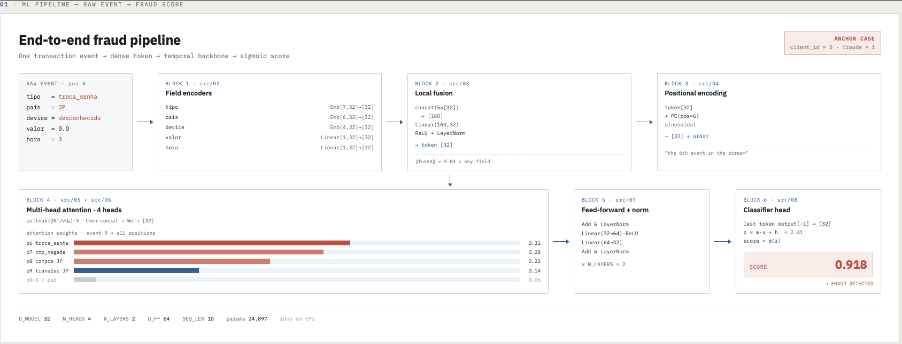
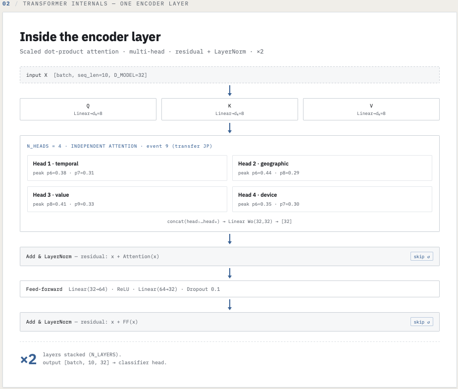
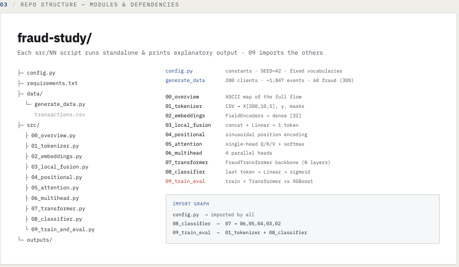
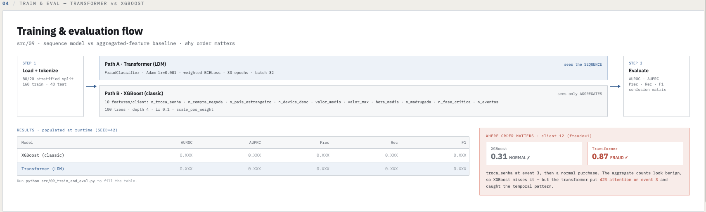

# Transformer Fraud Detection — Didático

Implementação passo a passo de um transformer para detecção de fraude bancária com dados sintéticos.
Objetivo: entender o fluxo completo — não resolver fraude em produção.

## Arquitetura

O diagrama interativo está em [`docs/architecture.dc.html`](docs/architecture.dc.html) (abra no browser).

Quatro frames cobrem o projeto inteiro:

```
┌─────────────────────────────────────────────────────────────────────┐
│  01 · ML PIPELINE — raw event → fraud score                        │
│                                                                     │
│  [RAW EVENT] → [Field Encoders] → [Local Fusion] → [Pos. Encoding] │
│                                        ↓                            │
│               [Multi-Head Attention] → [FF + Norm] → [Classifier]  │
│                                                         score=0.918 │
└─────────────────────────────────────────────────────────────────────┘
┌─────────────────────────────────────────────────────────────────────┐
│  02 · TRANSFORMER INTERNALS — uma encoder layer                    │
│                                                                     │
│  X[batch,10,32] → Q/K/V (dₖ=8) → 4 heads → concat → Wo           │
│               → Add & LayerNorm (skip ↺)                           │
│               → FF Linear(32→64)·ReLU·Linear(64→32)               │
│               → Add & LayerNorm (skip ↺)   × N_LAYERS=2           │
└─────────────────────────────────────────────────────────────────────┘
┌─────────────────────────────────────────────────────────────────────┐
│  03 · REPO STRUCTURE — módulos e dependências                      │
│                                                                     │
│  config.py → todos                                                  │
│  08_classifier → 07 → 06, 05, 04, 03, 02                          │
│  09_train_eval → 01_tokenizer + 08_classifier                      │
└─────────────────────────────────────────────────────────────────────┘
┌─────────────────────────────────────────────────────────────────────┐
│  04 · TRAIN & EVAL — Transformer vs XGBoost                        │
│                                                                     │
│  Path A: FraudClassifier · vê a SEQUÊNCIA                          │
│  Path B: XGBoost · vê só AGREGADOS (10 features/cliente)           │
│                                                                     │
│  Caso onde a ordem importa: XGBoost=0.31 NORMAL ✗                  │
│                             Transformer=0.87 FRAUD ✓               │
└─────────────────────────────────────────────────────────────────────┘
```

### Pipeline de Fraudes


### Camadada de Encoding


### Estrutura do Repositório


### Fluxo de Treino e Avaliação


## Setup

```bash
cd fraud-study
python -m venv venv
source venv/bin/activate   # Mac/Linux
pip install -r requirements.txt
```

## Executar

```bash
# 1. Gerar dados sintéticos
python data/generate_data.py

# 2. Ver o fluxo completo (overview)
python src/00_overview.py

# 3. Cada bloco em ordem
python src/01_tokenizer.py
python src/02_embeddings.py
python src/03_local_fusion.py
python src/04_positional.py
python src/05_attention.py
python src/06_multihead.py
python src/07_transformer.py
python src/08_classifier.py
python src/09_train_and_eval.py
```

## Estrutura

| Arquivo | O que faz |
|---------|-----------|
| `config.py` | Constantes globais e seed de reprodutibilidade |
| `data/generate_data.py` | Gera 200 clientes com event streams sintéticos (30% fraude) |
| `src/00_overview.py` | Diagrama ASCII do fluxo completo |
| `src/01_tokenizer.py` | CSV → arrays numpy (label encoding + normalização) |
| `src/02_embeddings.py` | Índices → vetores densos (nn.Embedding + nn.Linear) |
| `src/03_local_fusion.py` | 5 vetores de campo → 1 token (concat + projeção linear) |
| `src/04_positional.py` | Adiciona posição temporal (sinusoidal encoding) |
| `src/05_attention.py` | Single-head attention com visualização da matriz |
| `src/06_multihead.py` | 4 cabeças de atenção em paralelo |
| `src/07_transformer.py` | Backbone completo (N camadas empilhadas) |
| `src/08_classifier.py` | Score de fraude via sigmoid no último token |
| `src/09_train_and_eval.py` | Treino + comparação Transformer vs XGBoost |
| `docs/architecture.dc.html` | Diagrama interativo de arquitetura (4 frames) |

## Conceitos implementados

- Field encoders (`nn.Embedding` + `nn.Linear`)
- Local fusion (concatenação + projeção linear + ReLU + LayerNorm)
- Positional encoding sinusoidal (Vaswani et al., 2017)
- Scaled dot-product attention (Q, K, V, softmax)
- Multi-head attention (N cabeças paralelas)
- Residual connections + Layer Normalization
- Temporal backbone (N camadas empilhadas)
- Classificação binária via sigmoid
- Comparação com modelo clássico (XGBoost com features agregadas)

## Parâmetros principais

| Parâmetro | Valor | Descrição |
|-----------|-------|-----------|
| `D_MODEL` | 32 | Dimensão dos embeddings |
| `N_HEADS` | 4 | Cabeças de atenção (dₖ = 8 por cabeça) |
| `N_LAYERS` | 2 | Camadas do transformer |
| `D_FF` | 64 | Dimensão interna do feed-forward |
| `SEQ_LEN` | 10 | Tamanho da sequência (padding/truncate) |
| `EPOCHS` | 30 | Épocas de treino |
| params | 24,897 | Total de parâmetros treináveis |
